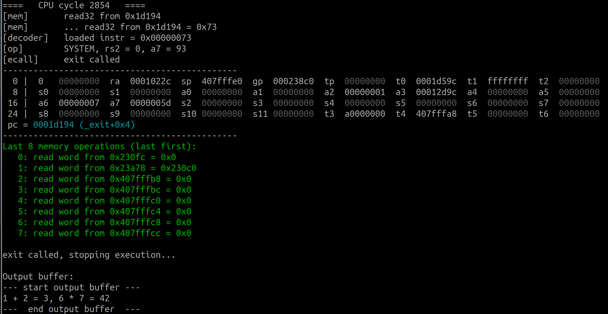

# Jan's RISC-V Playground

Welcome to my playground for the RISC-V!

## Implementations

ERVP stands for Experimental RISC-V Processor

### ERVP-01

* This is my first attempt at writing a RISC-V processor
* It has no practical value - but a high pedagogical value, at least for me
* It is an emulator, written in C, meant to run on an x86_64 (or on another
  RISC-V CPU if "Inception" is your favorite movie - *dramatic music increases*)
* It implements just the bare minimum to be able to run `software/hello_world`
* Some instructions are even not implemented, search for `TODO`s
* For I/O it uses a single buffer at `0xa0000000` which is printed out at the
  end of the execution
* The processor has fulfilled its mission by successfully executing a minimal
  RISC-V program:



## Notes

### 2021-07-21

#### MIT 6.004

[MIT 6.004 L02: RISC-V Assembly](https://www.youtube.com/watch?v=41RyDXIoq2w)

[MIT 6.004 L14: Implementing RISC-V Processor in Hardware](https://www.youtube.com/watch?v=c23MThWhXMw)

#### Vivado

https://www.xilinx.com/support/documentation/ip_documentation/zynq_ultra_ps_e_vip/v1_0/ds941-zynq-ultra-ps-e-vip.pdf

### 2021-07-20

#### ECALL

```
│   0x200ac <_exit+16>      addi    sp,sp,-16
│   0x200b0 <_exit+20>      sw      s0,8(sp)
│   0x200b4 <_exit+24>      mv      s0,a0
│   0x200b8 <_exit+28>      sw      ra,12(sp)
│   0x200bc <_exit+32>      neg     s0,s0
│   0x200c0 <_exit+36>      jal     ra,0x1d1c4 <__errno>
│   0x200c4 <_exit+40>      sw      s0,0(a0)
│   0x200c8 <_exit+44>      j       0x200c8 <_exit+44>
│   0x200cc <_fstat>        addi    sp,sp,-144
│   0x200d0 <_fstat+4>      sw      s1,132(sp)
│   0x200d4 <_fstat+8>      sw      ra,140(sp)
│   0x200d8 <_fstat+12>     mv      s1,a1
│  >0x200dc <_fstat+16>     sw      s0,136(sp)
│   0x200e0 <_fstat+20>     li      a7,80
│   0x200e4 <_fstat+24>     mv      a1,sp
│   0x200e8 <_fstat+28>     ecall
│   0x200ec <_fstat+32>     mv      s0,a0
│   0x200f0 <_fstat+36>     bltz    a0,0x20118 <_fstat+76>
```

https://github.com/riscvarchive/riscv-linux/blob/32b1573d1f118844d859341d095e005ca5ba572e/arch/riscv/include/asm/sbi.h#L30

https://groups.google.com/a/groups.riscv.org/g/sw-dev/c/exbrzM3GZDQ

**list of sys calls**:

https://github.com/riscv/riscv-pk/blob/66d7fcb56d6a4cd4879922f184bb2274918ac3cd/pk/syscall.h

##### fstat

```
====   CPU cycle  471   ====
[mem]       read32 from 0x1fb24
[mem]       ... read32 from 0x1fb24 = 0x10593
[decoder]   loaded instr = 0x00010593
[op]        group ALU IMM - ADDI, rd = 11, funct3 = 0, rs1 = 2, imm = 0x0 (0)
----------------------------------------------
  0 |  0   00000000  ra  0001cfa8  sp  407ffc70  gp  000268c0  tp  00000000  t0  000102ac  t1  0000000f  t2  00000000
  8 |  s0  000260c0  s1  407ffd18  a0  00000001  a1  407ffc70  a2  407ffd18  a3  00000000  a4  00000001  a5  00002009
 16 |  a6  00000000  a7  00000050  s2  00024c00  s3  00000000  s4  00000000  s5  00000000  s6  00000000  s7  00000000
 24 |  s8  00026414  s9  00000000  s10 000260c0  s11 00000000  t3  00000000  t4  00000000  t5  00000000  t6  00000000
 pc = 0001fb28 (_fstat+0x1c)
----------------------------------------------
Last 8 memory operations (last first):
   0: write word to 0x407ffcf8 = 0x260c0
   1: write word to 0x407ffcfc = 0x1cfa8
   2: write word to 0x407ffcf4 = 0x260c0
   3: write word to 0x26a9c = 0x0
   4: write word to 0x407ffd0c = 0x16948
   5: write word to 0x407ffd04 = 0x260c0
   6: write word to 0x407ffd08 = 0x26414
   7: read halfword from 0x26422 = 0x1
====   CPU cycle  472   ====
[mem]       read32 from 0x1fb28
[mem]       ... read32 from 0x1fb28 = 0x73
[decoder]   loaded instr = 0x00000073
[op]        SYSTEM, rs2 = 0, a7 = 80
[ecall]     unimplemented system call (80)
```

https://github.com/riscv/riscv-newlib/blob/f289cef6be67da67b2d97a47d6576fa7e6b4c858/libgloss/riscv/sys_fstat.c

```c
  struct kernel_stat kst;
  int rv = syscall_errno (SYS_fstat, file, &kst, 0, 0, 0, 0);
```

```c
static inline long
syscall_errno(long n, long _a0, long _a1, long _a2, long _a3, long _a4, long _a5)
{
  long a0 = __internal_syscall (n, _a0, _a1, _a2, _a3, _a4, _a5);
```

#### Execution environment

https://github.com/riscv/riscv-isa-manual/releases/download/Ratified-IMFDQC-and-Priv-v1.11/riscv-privileged-20190608.pdf

https://matrix89.github.io/writes/writes/experiments-in-riscv/

#### GDB + QEMU

https://qemu-project.gitlab.io/qemu/system/gdb.html

##### QEMU

```console
$ qemu-riscv32 -g 1234   ./software/hello_world
```

##### GDB

```console
$ riscv32-unknown-elf-gdb ./software/hello_world
GNU gdb (GDB) 10.1
Copyright (C) 2020 Free Software Foundation, Inc.
License GPLv3+: GNU GPL version 3 or later <http://gnu.org/licenses/gpl.html>
This is free software: you are free to change and redistribute it.
There is NO WARRANTY, to the extent permitted by law.
Type "show copying" and "show warranty" for details.
This GDB was configured as "--host=x86_64-pc-linux-gnu --target=riscv32-unknown-elf".
Type "show configuration" for configuration details.
For bug reporting instructions, please see:
<https://www.gnu.org/software/gdb/bugs/>.
Find the GDB manual and other documentation resources online at:
    <http://www.gnu.org/software/gdb/documentation/>.

For help, type "help".
Type "apropos word" to search for commands related to "word"...
Reading symbols from ./software/hello_world...
(gdb) target remote localhost:1234
Remote debugging using localhost:1234
0x0001008c in _start ()
(gdb) info registers
ra             0x0	0x0
sp             0x407ffff0	0x407ffff0
gp             0x0	0x0
tp             0x0	0x0
t0             0x0	0
t1             0x0	0
t2             0x0	0
fp             0x0	0x0
s1             0x0	0
<...>
```

Important commands:

* `target remote localhost:1234`
* `layout asm`
* `layout regs`
* `stepi`
* `tui new-layout example {-horizontal regs 1 asm 1} 2 status 0 cmd 1`

#### Symbol table in ELF

https://stackoverflow.com/questions/48181509/how-to-interpret-the-st-info-field-of-elf-symbol-table-section

### 2021-07-19

[CppCon 2018: Matt Godbolt “The Bits Between the Bits: How We Get to main()”](https://www.youtube.com/watch?v=dOfucXtyEsU)


### 2021-07-18

#### ELF file

https://blog.k3170makan.com/2018/09/introduction-to-elf-format-elf-header.html

```console
$ riscv64-unknown-elf-readelf -h ../software/hello_world
ELF Header:
  Magic:   7f 45 4c 46 02 01 01 00 00 00 00 00 00 00 00 00
  Class:                             ELF64
  Data:                              2's complement, little endian
  Version:                           1 (current)
  OS/ABI:                            UNIX - System V
  ABI Version:                       0
  Type:                              EXEC (Executable file)
  Machine:                           RISC-V
  Version:                           0x1
  Entry point address:               0x100c4
  Start of program headers:          64 (bytes into file)
  Start of section headers:          131736 (bytes into file)
  Flags:                             0x5, RVC, double-float ABI
  Size of this header:               64 (bytes)
  Size of program headers:           56 (bytes)
  Number of program headers:         2
  Size of section headers:           64 (bytes)
  Number of section headers:         23
  Section header string table index: 22
```

https://people.redhat.com/mpolacek/src/devconf2012.pdf

https://sourceware.org/git/?p=glibc.git;a=blob;f=elf/elf.h;h=4738dfa28f6549fc11654996a15659dc8007e686;hb=HEAD

https://blog.k3170makan.com/2018/09/introduction-to-elf-file-format-part.html

##### sections

- `.text` - instructions
- `.rodata` - read only data
- `.eh_frame` - exception handling (https://stackoverflow.com/questions/26300819/why-gcc-compiled-c-program-needs-eh-frame-section)
- `.init_array` - functions called at the init (`DT_INIT_ARRAY`)
- `.fini_array` - functions called in final stage
- `.data` - initialized data
- `.sdata` - small data
- `.sbss` - small uninitialized data
- `.bss` - uninitialized data
- `.comment`
- `.riscv.attributes` (https://github.com/riscv/riscv-elf-psabi-doc/blob/master/riscv-elf.md#special-sections)
- `.debug_aranges`
- `.debug_info`
- `.debug_abbrev`
- `.debug_line`
- `.debug_frame`
- `.debug_str`
- `.debug_loc`
- `.debug_ranges`
- `.symtab`
- `.strtab`
- `.shstrtab`

```console
$ riscv64-unknown-elf-objdump --disassemble-all ../software/hello_world | head -n 30

../software/hello_world:     file format elf64-littleriscv


Disassembly of section .text:

00000000000100b0 <register_fini>:
   100b0:       00000793                li      a5,0
   100b4:       c799                    beqz    a5,100c2 <register_fini+0x12>
   100b6:       00002517                auipc   a0,0x2
   100ba:       62250513                addi    a0,a0,1570 # 126d8 <__libc_fini_array>
   100be:       0d40906f                j       19192 <atexit>
   100c2:       8082                    ret

00000000000100c4 <_start>:
   100c4:       0000f197                auipc   gp,0xf
   100c8:       05c18193                addi    gp,gp,92 # 1f120 <__global_pointer$>
   100cc:       76818513                addi    a0,gp,1896 # 1f888 <_PathLocale>
   100d0:       00010617                auipc   a2,0x10
   100d4:       85060613                addi    a2,a2,-1968 # 1f920 <__BSS_END__>
   100d8:       8e09                    sub     a2,a2,a0
   100da:       4581                    li      a1,0
   100dc:       170000ef                jal     ra,1024c <memset>
   100e0:       00009517                auipc   a0,0x9
   100e4:       0b250513                addi    a0,a0,178 # 19192 <atexit>
   100e8:       c519                    beqz    a0,100f6 <_start+0x32>
   100ea:       00002517                auipc   a0,0x2
   100ee:       5ee50513                addi    a0,a0,1518 # 126d8 <__libc_fini_array>
   100f2:       0a0090ef                jal     ra,19192 <atexit>
   100f6:       0ec000ef                jal     ra,101e2 <__libc_init_array>
```

#### Register names

https://riscv.org/wp-content/uploads/2015/01/riscv-calling.pdf

#### GCC options

https://gcc.gnu.org/onlinedocs/gcc/RISC-V-Options.html

https://www.sifive.com/blog/all-aboard-part-1-compiler-args

#### GCC

https://github.com/riscv/riscv-gnu-toolchain.git

https://stackoverflow.com/a/32538388

https://github.com/riscv/riscv-gnu-toolchain/issues/87

https://github.com/cliffordwolf/picorv32#building-a-pure-rv32i-toolchain
